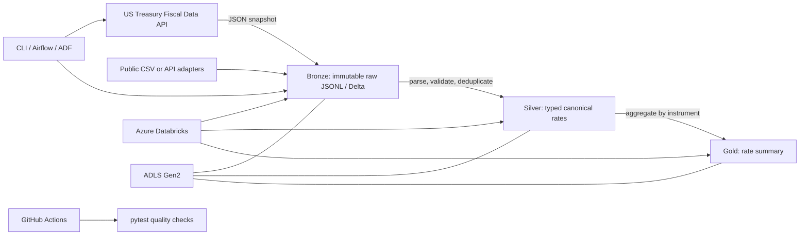

# Architecture and lineage

## Layer contracts

- **Bronze**: source-aligned rows with `_source` and `_ingested_at`; append-only run folders in the local adapter. Preserve source values for replay.
- **Silver**: canonical `record_date`, `instrument`, and `rate_pct`; rejects are recorded separately. Required fields, unparseable dates, negative rates, and duplicates are handled explicitly. A configurable invalid-row threshold blocks publication.
- **Gold**: one row per instrument with observation count, average/min/max/latest rate, and as-of date. This is an analytics table, not a claim of business impact.

The local JSONL adapter runs without Spark or Azure. The Databricks notebook demonstrates corresponding Delta tables. For a hardened production implementation, use Delta `MERGE` with `(record_date, instrument)` as the business key, persist a source watermark, quarantine invalid records, and use transactional table writes. These are deployment recommendations and are not implied by the local JSONL adapter.

## KPIs to measure

The CLI reports input/accepted/rejected/output row counts and rejected-row rate. For reproducible performance benchmarks, record source row count, runtime, CPU/memory, files scanned/written, and query latency against the same fixed fixture and cluster/runtime. **No throughput, 50M-record/day, latency reduction, or anomaly-detection percentage is claimed until a benchmark is run and its environment/results are recorded.**
